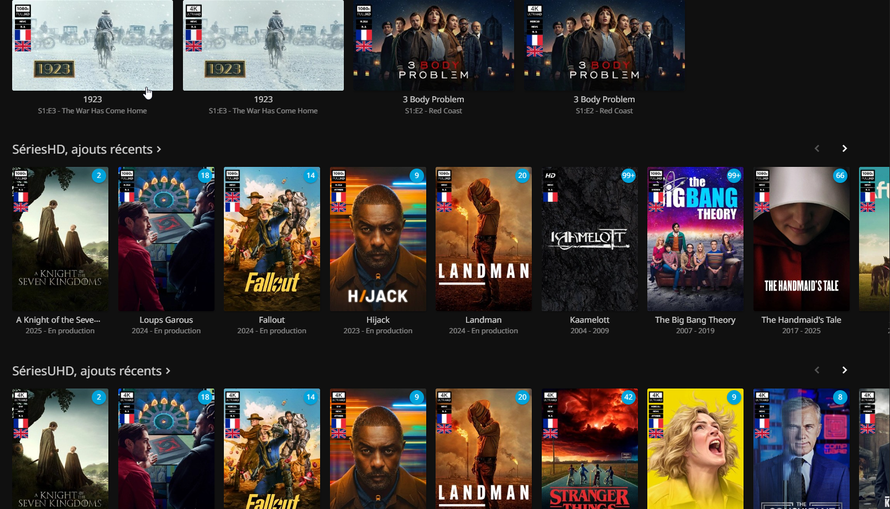
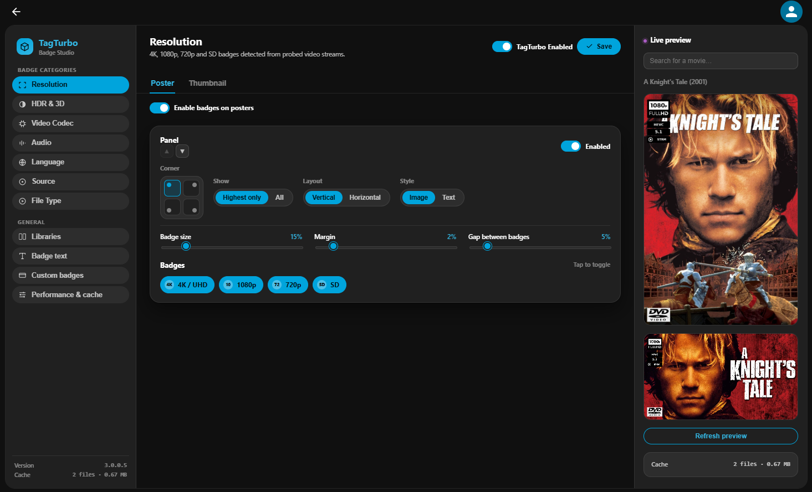

This is a fork of https://github.com/Atilil/jellyfin-plugins/tree/main/Jellytag

## Differences from the original

- Retargeted to Jellyfin 12.0 / .NET 10 (the original targets Jellyfin 10.11 / .NET 9), under its own plugin identity — namespace, assembly name, and GUID renamed from `JellyTag` to `TagTurbo` so it can be installed alongside the original.
- Added two badge categories not present upstream: **Source** (DVD/Blu-ray, detected by scanning parent folders for source tags/disc markers) and **File Type** (flags `.strm`-based library entries).
- The config page's version display now reads the actual running assembly version instead of a hardcoded value, and tolerates different `getInstalledPlugins()` response shapes.
- Fixed an authentication bug in the badge gallery preview (it returned 401 because the preview route didn't honor the query-string `api_key`) and repackaged the release to include SVG-rendering dependencies (ExCSS, ShimSkiaSharp, Svg.Custom, Svg.Model, Svg.Skia) that were missing from the original packaging.
- Ships its own Jellyfin plugin repository manifest for one-click catalog installs (see Installation below).

# TagTurbo — Quality Badge Plugin for Jellyfin

TagTurbo automatically overlays quality badges (resolution, HDR, codec, audio, language) on your media posters and thumbnails. Badges are rendered server-side via HTTP middleware, so they appear on **all Jellyfin clients** without any configuration.

<p align="center">
    
</p>

## Features

- **Multi-category badges**: Resolution, HDR, 3D, Video Codec, Audio, Language flags, Source (DVD/Blu-ray), File Type (STRM), and VOST indicator
- **Universal client support**: Server-side rendering via HTTP middleware — works on all Jellyfin clients
- **Per-image-type configuration**: Independent settings for posters and thumbnails (position, size, layout, style)
- **Per-panel customization**: Each badge category has its own panel with position, layout, ordering, colors, and display mode (highest only or all)
- **SVG & text badge styles**: Choose between SVG image badges or text-based badges with customizable colors, opacity, and corner radius
- **Per-badge style overrides**: Override the background color, opacity, text color, and corner radius of an individual badge without changing the rest of its panel
- **Custom badges**: Replace any default badge with your own SVG/PNG/JPEG, or customize text labels — via the config UI or API
- **Source & file type detection**: Flags DVD/Blu-ray sourced media (by scanning parent folders for source tags/disc markers) and `.strm`-based library entries
- **Live preview**: See badge changes in real-time directly in the configuration page
- **Library filtering**: Exclude specific libraries from badge generation
- **Config export/import**: Backup and restore your configuration as JSON
- **File-based caching**: Processed images are cached to disk with automatic expiration

## Screenshots




## Installation

1. In Jellyfin, go to **Dashboard** → **Plugins** → **Repositories**
2. Add a new repository with this URL:
   ```
   https://github.com/planet22/JellyTagTurbo/raw/main/manifest.json
   ```
3. Go to **Catalog**, find **TagTurbo** and install it
4. Restart Jellyfin

## Configuration

Go to **Dashboard** → **Plugins** → **TagTurbo** to access the configuration page.

### Global Settings

| Option | Description | Default |
|--------|-------------|--------|
| Enable TagTurbo | Enable/disable the plugin globally | Enabled |
| Output Format | JPEG or WebP | JPEG |
| JPEG Quality | Output image quality when Output Format is JPEG (50-100) | 90 |
| WebP Quality | Output image quality when Output Format is WebP (50-100) | 90 |
| Cache Duration | How long cached images are kept (hours) | 24 |
| Excluded Libraries | Libraries to skip for badge generation | None |

### Image Type Settings (Poster / Thumbnail)

Each image type has independent panel settings. Thumbnails can optionally mirror poster settings, scaled down by a configurable size reduction (default 5 percentage points).

Each badge category (Resolution, HDR, 3D, Codec, Audio, Language, Source, File Type) is configured as a **panel** with:

| Setting | Description |
|---------|-------------|
| Enabled | Show/hide this category |
| Position | Corner placement (TopLeft, TopRight, BottomLeft, BottomRight) |
| Layout | Horizontal or Vertical stacking |
| Style | Image (SVG) or Text badges |
| Size % | Badge width as percentage of image |
| Margin % | Distance from edge |
| Gap % | Spacing between badges |
| Display Mode | Show highest quality only, or all |
| Order | Panel stacking order |
| Text colors | Panel-wide background color, text color, opacity, corner radius |

Individual badges can also override their panel's text style (background/text color, opacity, corner radius) independently, so a single badge can stand out without changing the rest of the panel.

The VOST (original-language / subtitle) indicator has its own enable flag plus background color, text color, opacity, and corner radius settings.

## Custom Badges

You can replace any default badge with your own image or customize the text label for text-style badges.

- **Via the config UI**: Use the Custom Badges section to upload SVG, PNG, or JPEG files, and set custom text per badge
- **Via the API**: `POST /TagTurbo/CustomBadge/{badgeKey}` to upload (5 MB max, SVG/PNG/JPEG only), `DELETE` to revert to default, `GET /TagTurbo/CustomBadges` to list current overrides, `GET /TagTurbo/BadgePreview/{badgeKey}` to preview a badge image

Custom badges are stored in the plugin data folder and survive updates.

## API Reference

Beyond custom badges, the plugin exposes a few management endpoints (all under `/TagTurbo`):

| Endpoint | Description |
|----------|-------------|
| `POST /TagTurbo/ClearCache` | Clears the on-disk image and badge caches |
| `GET /TagTurbo/CacheStats` | Returns cached file count, total size, oldest/newest entry |
| `GET /TagTurbo/Status` | Returns current enabled state and output format |
| `GET /TagTurbo/ExportConfig` | Exports the full configuration as JSON |
| `POST /TagTurbo/ImportConfig` | Imports a configuration JSON (1 MB max); automatically migrates older config schemas |
| `POST /TagTurbo/ResetConfig` | Resets configuration to defaults |
| `GET /TagTurbo/Debug/Resources`, `GET /TagTurbo/Debug/Badge/{quality}` | Debug helpers for inspecting bundled badge resources |

Configuration export/import in the UI (see Global Settings) uses the same endpoints, and older flat-schema configs are migrated automatically to the current panel-based model on import or plugin load.

## How It Works

TagTurbo intercepts Jellyfin image requests via HTTP middleware, detects media quality from metadata, composites badges onto images using SkiaSharp, and caches the results to disk. No reverse proxy or client-side configuration needed.

## Requirements

- Jellyfin 12.0.x or later
- .NET 10.0 runtime (included with Jellyfin 12.0+)

## Troubleshooting

- **Badges not appearing**: Verify the plugin is enabled, check that badge categories are enabled, clear browser cache and plugin image cache
- **Clearing the cache**: Use the "Clear Image Cache" button in the config page
- **Performance**: Increase cache duration, lower JPEG quality, disable unneeded badge categories

## License

MIT License
